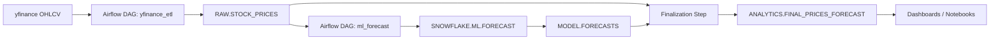

# Stock Analytics Pipeline — Airflow + Snowflake + yfinance

## Abstract
This repository implements a secure, reproducible **stock analytics pipeline**. An **Apache Airflow** ETL DAG ingests daily OHLCV from **yfinance**, normalizes any **MultiIndex** columns to a flat schema, and upserts into **Snowflake** using `MERGE` for idempotency. A second DAG trains a Snowflake‑native **`SNOWFLAKE.ML.FORECAST`** time‑series model and writes predictions to **`MODEL.FORECASTS`**. A final table, **`ANALYTICS.FINAL_PRICES_FORECAST`**, unions actuals and forecasts for direct BI/Notebook consumption. Secrets live in **Airflow Connections**; runtime parameters live in **Airflow Variables**.

---

## Highlights
- **Two DAGs:** `yfinance_etl` (RAW load) and `ml_forecast` (train → predict → finalize)
- **Idempotent loads:** Snowflake `MERGE` keyed by `(SYMBOL, TS)`; safe re‑runs & backfills
- **MultiIndex‑safe ingestion:** flattens yfinance columns to single‑level, `snake_case`
- **Clean lineage:** `RAW` → `MODEL` → `ANALYTICS`, wrapped in atomic transactions
- **Configurable:** symbols, lookback, horizon via Airflow Variables
- **Security‑first:** credentials only in Airflow Connections

---

## Architecture

---


## Snowflake Model

**`RAW.STOCK_PRICES`**  
| Column    | Type           | Notes               |
|-----------|----------------|---------------------|
| SYMBOL    | STRING         | part of PK          |
| TS        | TIMESTAMP_NTZ  | part of PK          |
| OPEN      | FLOAT          |                     |
| HIGH      | FLOAT          |                     |
| LOW       | FLOAT          |                     |
| CLOSE     | FLOAT          |                     |
| ADJ_CLOSE | FLOAT          |                     |
| VOLUME    | NUMBER(38,0)   |                     |
| LOAD_TS   | TIMESTAMP_NTZ  | ingestion timestamp |

**`MODEL.FORECASTS`**  
| Column          | Type           | Notes                          |
|-----------------|----------------|--------------------------------|
| SYMBOL          | STRING         | part of PK                     |
| TS              | TIMESTAMP_NTZ  | forecasted timestamp, part PK  |
| PREDICTED_CLOSE | FLOAT          | model prediction               |
| MODEL_NAME      | STRING         | part of PK                     |
| TRAINED_AT      | TIMESTAMP_NTZ  |                                |
| HORIZON_D       | NUMBER         | forecast horizon (days)        |
| LOAD_TS         | TIMESTAMP_NTZ  | write time                     |

**`ANALYTICS.FINAL_PRICES_FORECAST`**  
Union of **ACTUAL** (from `RAW`) and **FORECAST** (from `MODEL`) with a `SOURCE` flag (`ACTUAL`|`FORECAST`).

---

## Quickstart

### Prerequisites
- Apache Airflow (Docker Compose OK)
- Snowflake account (role, warehouse, database)
- Airflow image/packages: `yfinance`, `snowflake-connector-python`, `apache-airflow-providers-snowflake`

### 1) Airflow Connection (secrets)
Create a Snowflake connection in **Admin → Connections**.

- Conn Id: `snowflake_default`  
- Conn Type: `Snowflake`  
- Extra (JSON):
```json
{
  "account": "<account>",
  "warehouse": "<warehouse>",
  "database": "<database>",
  "schema": "RAW",
  "role": "<role>"
}
```

### 2) Airflow Variables (parameters)
Create these in **Admin → Variables**:
```json
{
  "stock_symbols": ["AAPL", "MSFT", "TSLA"],
  "lookback_days": 365,
  "forecast_horizon_days": 14,
  "target_schema_raw": "RAW",
  "target_schema_model": "MODEL",
  "target_schema_analytics": "ANALYTICS"
}
```

### 3) Run order
1. Trigger **`yfinance_etl`** to populate `RAW.STOCK_PRICES`.  
2. Trigger **`ml_forecast`** to train, predict, and publish `ANALYTICS.FINAL_PRICES_FORECAST`.

---

## Implementation Notes

### ETL Upsert (idempotent load)
```sql
MERGE INTO RAW.STOCK_PRICES t
USING (SELECT :SYMBOL AS SYMBOL, :TS::TIMESTAMP_NTZ AS TS, :OPEN, :HIGH, :LOW, :CLOSE, :ADJ_CLOSE, :VOLUME) s
  ON t.SYMBOL = s.SYMBOL AND t.TS = s.TS
WHEN MATCHED THEN UPDATE SET
  OPEN = s.OPEN, HIGH = s.HIGH, LOW = s.LOW, CLOSE = s.CLOSE,
  ADJ_CLOSE = s.ADJ_CLOSE, VOLUME = s.VOLUME, LOAD_TS = CURRENT_TIMESTAMP()
WHEN NOT MATCHED THEN INSERT (SYMBOL, TS, OPEN, HIGH, LOW, CLOSE, ADJ_CLOSE, VOLUME, LOAD_TS)
VALUES (s.SYMBOL, s.TS, s.OPEN, s.HIGH, s.LOW, s.CLOSE, s.ADJ_CLOSE, s.VOLUME, CURRENT_TIMESTAMP());
```

### MultiIndex Normalization
If yfinance returns **MultiIndex** columns (multiple tickers/fields), flatten to single‑level `snake_case` names to maintain stable DDL and keys.

### Forecasting Flow
1. `CREATE OR REPLACE MODEL` with `SNOWFLAKE.ML.FORECAST` over history in `RAW.STOCK_PRICES`.  
2. `PREDICT` for the configured horizon into a staging table.  
3. `MERGE` predictions into `MODEL.FORECASTS`.  
4. Rebuild `ANALYTICS.FINAL_PRICES_FORECAST` by unioning ACTUAL rows from `RAW` and FORECAST rows from `MODEL`.

---

## Validation Queries
```sql
-- Row counts by layer
SELECT 'RAW' AS layer, COUNT(*) c FROM RAW.STOCK_PRICES
UNION ALL SELECT 'MODEL', COUNT(*) FROM MODEL.FORECASTS
UNION ALL SELECT 'ANALYTICS', COUNT(*) FROM ANALYTICS.FINAL_PRICES_FORECAST;

-- Symbol coverage and time span
SELECT SYMBOL, MIN(TS) AS min_ts, MAX(TS) AS max_ts, COUNT(*) AS n
FROM ANALYTICS.FINAL_PRICES_FORECAST
GROUP BY SYMBOL
ORDER BY SYMBOL;
```

---

## Consuming the Data
Query `ANALYTICS.FINAL_PRICES_FORECAST` for dashboards/notebooks.  
Key fields: `SYMBOL`, `TS`, `SOURCE` (`ACTUAL`|`FORECAST`), `CLOSE`, `PREDICTED_CLOSE`.

---

## Suggested Repo Layout
```
dags/
  yfinance_etl.py
  ml_forecast.py
sql/
  bootstrap_ddl.sql
  analytics_checks.sql
docs/
  screenshots/
```

---

## TL;DR
Airflow orchestrates ingestion and Snowflake‑native forecasting; the output is a single analytics table blending actuals and predictions for downstream use.


